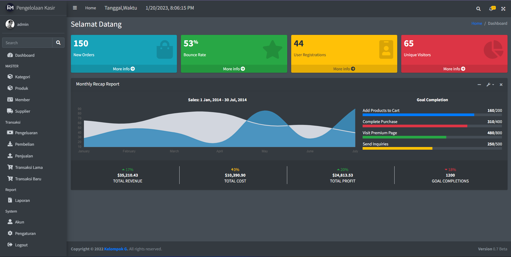
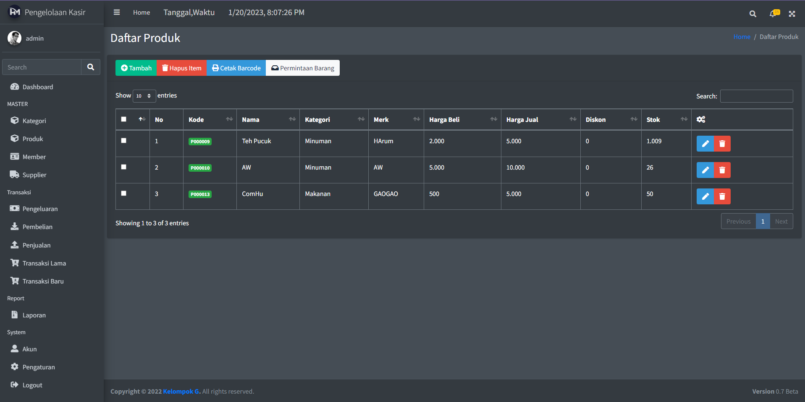
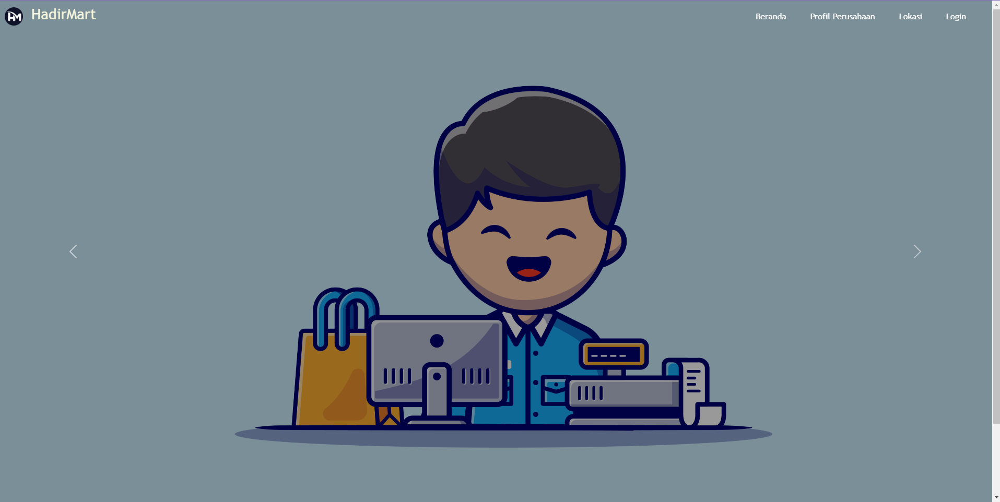

<h1 align="center">Aplikasi Kasir</h1>

_ini aplikasi dibuat untuk memenuhi tugas besar PemrogramanWEBLanjutan_
_Berikut Gambar dari aplikasi yang kami buat_

## ScreenShoot

<h3>Logo</h3>

<h3>Tampilan Dashboard</h3>

<h3>Tampilan Produk</h3>

<h3>Tampilan Landingpage</h3>

## Roadmap

- [x] Dashboard
- [x] Landing Page
- [x] Authentication
- [x] CRUD Kategori
- [x] CRUD Produk
- [x] Multipel Selected For Delete Item
- [x] CRUD Member + Cetak Kartu Member PDF
- [x] CRUD Supplier
- [x] CRUD Pengeluaran
- [x] CRUD Pembelian Produk ( sedikit bug tidak bisa menampilkan detail dari pembelian produk )
- [x] CRUD Penjualan (Penjualan Produk)
- [ ] Laporan Ada bug
- [x] Manajemen Akun (2 role : Admin , Kasir)
- [ ] Pengaturan
- [x] MailTrap untuk mengirimkan notif ke Email Ada Bug
- [x] Import Export Excel File

## Fitur :

- Bisa Mencetak Kartu Member
- Fitur Diskon setiap pembelian produk untuk dijual
- Untuk Member akan Mendapatkan potongan diskon bisa di set di pengaturan
- Ada 2 role untuk saat ini
- Tampilan Minimalis
- Notofikasi Sweetalert

## Requirements

- PHP >= 7.0 (or higher)
- Composer
- Node.js
- NPM
- MySQL

## Installation

1.  Clone Repository
2.  Run `composer install`
3.  Run `npm install`
4.  Run `npm run dev`
5.  Buat Database lalu update .env bisa juga cp .env.example .env
6.  Run `php artisan key:generate`
7.  Run `php artisan migrate`
8.  Run `php artisan db:seed `
9.  Run `php artisan serve`
10. Login dengan user dibawah

    - Email: `admin@gmail.com`
    - Password: `12345`

11. Enjoy!

## Contact

- [GitHub](https://www.github.com/Fekka1st/)

## Catatan

- Aplikasi ini masih banyak mengalami bug jadi mohon maaf bila belum selesai 100%
- Jika ingin mengembangkan aplikasi ini dipersilahkan
