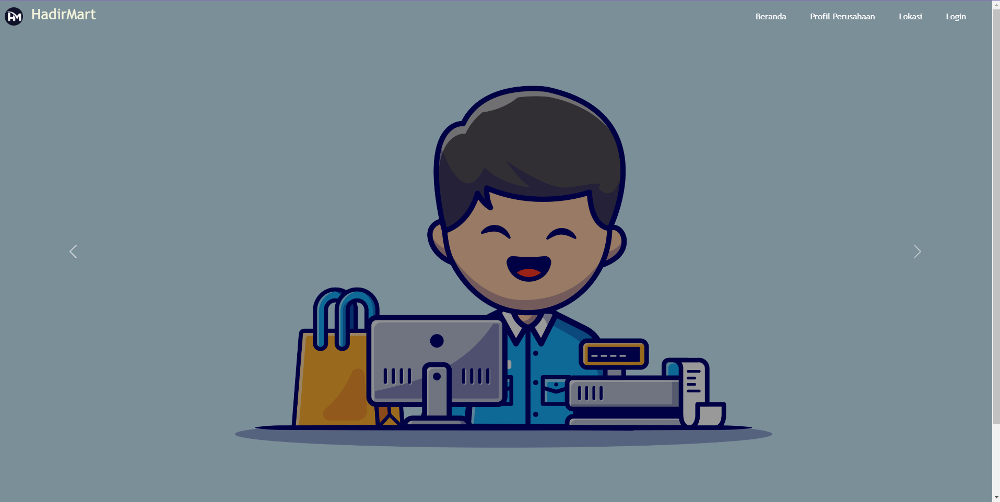
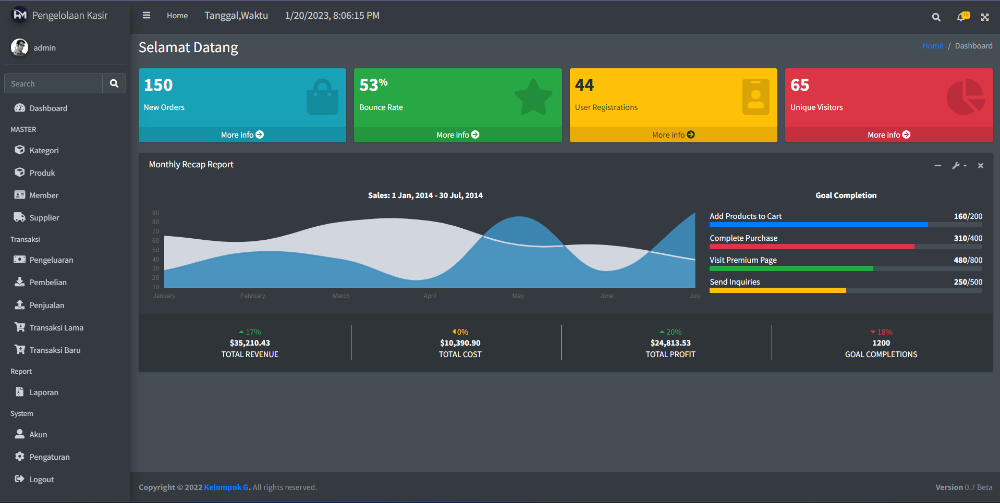
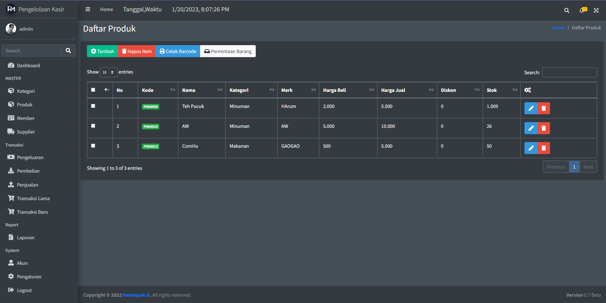

<div align="center">
  
  
  <h1>🛒 Aplikasi Kasir (Point of Sales)</h1>
  
  <p><b>Sistem Manajemen Kasir Minimalis dan Modern untuk Memudahkan Bisnis Anda.</b></p>

  <!-- Badges -->
  <p>
    
    
    
    
  </p>
</div>

<br>

Aplikasi Kasir adalah sistem *Point of Sales* (POS) berbasis web yang dirancang untuk mempermudah transaksi penjualan, pencatatan pengeluaran, manajemen stok, hingga pengelolaan pelanggan (member).

---

## ✨ Fitur Unggulan

- 👥 **Manajemen Member:** Dilengkapi dengan fitur **Cetak Kartu Member (PDF)**.
- 💰 **Sistem Diskon Otomatis:** Potongan harga dapat diatur khusus untuk member di menu pengaturan, serta diskon manual per produk.
- 🔐 **Multi-role Authentication:** Tersedia 2 peran pengguna (Admin dan Kasir) dengan hak akses yang berbeda.
- 📊 **Import & Export Data:** Mendukung format Excel untuk kemudahan pengelolaan data.
- 🎨 **Tampilan Antarmuka Minimalis:** Desain yang bersih, responsif, dan interaktif dengan notifikasi dari **SweetAlert**.

---

## 📸 Screenshots

<details>
<summary><b>Klik untuk melihat tampilan aplikasi</b></summary>
<br>

**1. Logo Aplikasi**
<p align="center"></p>

**2. Tampilan Landing Page**
<p align="center"></p>

**3. Tampilan Dashboard**
<p align="center"></p>

**4. Manajemen Produk**
<p align="center"></p>

</details>

---

## 🛠️ Persyaratan Sistem (Requirements)

Sebelum menginstal, pastikan komputer Anda telah memasang:
- PHP >= 7.0 (atau lebih baru)
- Composer
- Node.js & NPM
- MySQL Database

---

## 🚀 Panduan Instalasi

Ikuti langkah-langkah di bawah ini untuk menjalankan project secara lokal:

1. **Clone Repository**
   ```bash
   git clone https://github.com/Fekka1st/nama-repo-kamu.git
   cd nama-repo-kamu
   ```
2. **Install Dependensi PHP & Node.js**
   ```bash
   composer install
   npm install
   npm run dev
   ```
3. **Konfigurasi Environment**
   Salin file konfigurasi lalu sesuaikan pengaturan database Anda di file `.env`.
   ```bash
   cp .env.example .env
   ```
4. **Generate App Key**
   ```bash
   php artisan key:generate
   ```
5. **Migrasi & Seeding Database**
   ```bash
   php artisan migrate
   php artisan db:seed
   ```
6. **Jalankan Aplikasi**
   ```bash
   php artisan serve
   ```

> **Akses Login Default:**
> - Email: `admin@gmail.com`
> - Password: `12345`

---

## 🗺️ Roadmap & Status Pengembangan

- [x] Dashboard & Landing Page
- [x] Authentication & Manajemen Akun (Admin & Kasir)
- [x] CRUD Kategori, Produk, & Pengeluaran
- [x] Multipel Selected for Delete Item
- [x] CRUD Member + Cetak Kartu Member (PDF)
- [x] CRUD Supplier
- [x] CRUD Pembelian Produk *(Terdapat bug: detail pembelian belum tampil)*
- [x] CRUD Penjualan (Transaksi Kasir)
- [x] Import & Export File Excel
- [ ] Laporan Penjualan *(Masih ada bug)*
- [x] Integrasi MailTrap untuk Notifikasi Email *(Masih ada bug)*
- [ ] Menu Pengaturan (Settings)

---

## 🤝 Berkontribusi (Contributing)

Aplikasi ini bersifat *Open-Source* dan masih dalam tahap pengembangan. Jika Anda menemukan bug atau ingin menambahkan fitur baru, kontribusi Anda sangat dinantikan! 

1. *Fork* repository ini.
2. Buat *branch* fitur Anda (`git checkout -b fitur-baru`).
3. *Commit* perubahan Anda (`git commit -m 'Menambahkan fitur baru'`).
4. *Push* ke *branch* (`git push origin fitur-baru`).
5. Buat *Pull Request*.

---

## 📞 Kontak

Dibuat dan dikembangkan oleh **[Fekka1st](https://www.github.com/Fekka1st/)**.  
Jika Anda memiliki pertanyaan atau masukan, silakan buat *issue* di repository ini.
